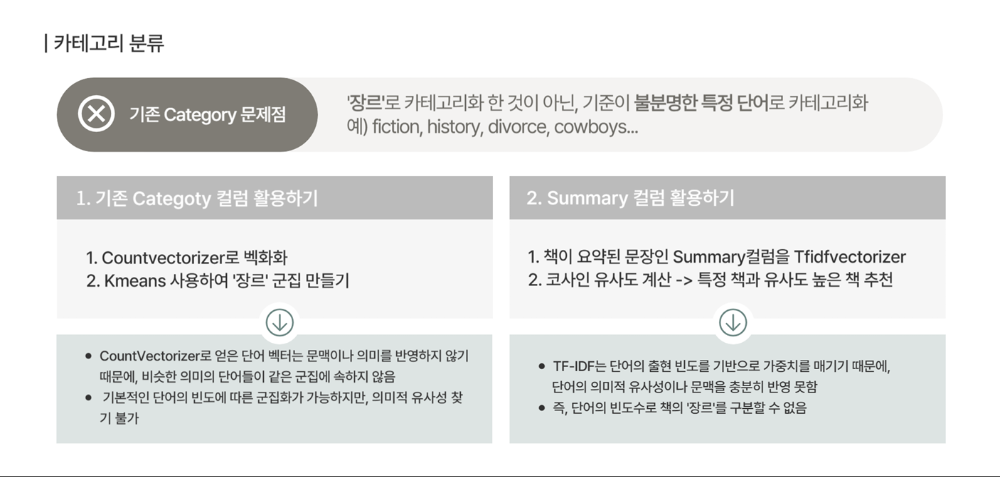

# 머신러닝을 활용한 추천 시스템 구현

**프로젝트 이름** : Bookitoki

**팀 이름** : Bookitoki

**프로젝트 개요** : 다양한 사용자들에게 취향에 맞게 책 추천을 해주어 책에 대한 접근성을 높혀 활발한 독서 문화 형성에 기여하는 것.

--------

### **개발 배경**
1. 잘파(Z+alpha) 세대의 저조한 문해력, 책 읽는 인구 감소 등. 독서를 경시하는 실태
2. 텍스트 힙의 출현으로 등장한 팬덤 구매 현상 등 독서 소비의 형태 변화

### **개발 목적**

독자들이 자연스럽게 책에 흥미를 느낄 수 있도록 접근성을 높이면서, 독서 문화의 토대를 만들어 나아가고자 '사용자 기반 책 추천 시스템 개발'

--------

### **시장 조사**

-------

### **프로젝트 소개**
- 프로젝트 기간 : 2024.11.5 ~ 11.11
- 팀원 : 김혜영, 유영준, 최수빈, 허채연
- 목적 : 사용자 맞춤형 책 추천 시스템 구현

--------
### **데이터 취득 및 전처리**

**데이터셋** : https://www.kaggle.com/datasets/ruchi798/bookcrossing-dataset/data

-----
### **기능 개요**

### **시연 영상**

[링크 삽입 구간.](https://drive.google.com/drive/folders/1sBdYstZMxD3goNaHydNORppfXdNQZNpb)

### **구현 기능에 따른 부가 설명**

- 사용자별 추천 기능 - 사용자가 읽은 책의 평점을 기반으로 평점 유사도가 높은 책 10권 추천
  - 평점 유사도 산출
  - 가중평점 예측
  - 가중평점 기반 상위 평점 도서들 조회

- 작가별 추천 기능 - 사용자가 읽은 책의 작가에 대한 평가를 기반으로, 작가 평점 유사도가 높은 책 10권 추천
  - 사용자 아이디 입력 받기. 
  - 입력받은 사용자 아이디 기반으로 그 사람이 가장 높은 평점을 준 작가 탐색 
  - 그 작가와 유사도가 높은 책들 추천

- 연령대별 추천 기능 - 사용자의 연령대별 상위 카테고리의 평점 높은 5권 추천, 다른 카테고리의 평점 높은 책 5권 추천 => 사용자게에 다양성 제공

  - 연령대 범주화
  - 범주화된 연령대에 맞춰, 유저의 연령대 확인
  - 유저의 연령대에 맞춰 해당 연령대가 높은 평점을 준 책 추천

- 카테고리별 추천 기능 - 사용자가 읽은 책의 카테고리에 해당하는 상위 10권의 책 추천
  - 사용자별 상위 카테고리 찾기
  - 선택된 상위 카테고리에서 상위 책 10권 추천
  - 최종 추천 테이블 생성(입력값:user_id)

-----

### **기대 효과**

- 독서 접근성 향상
- 독서 문화 촉진
- 차별화된 독서 경험 제공

----
### **소감**

**혜영**
- 정제되지 않은 데이터를 만나면서 데이터 수집에서부터 전처리 과정의 중요성
- 단어 임베딩을 사용해 유사한 의미를 가진 단어를 찾아 추천 시스템으로 디벨롭

**영준**
- 좌절을 통해서 해야하는 계기를 가지게 되었습니다.

**수빈**
- 이번 과정을 통해 여러 플랫폼에서 어떤 식으로 추천을 해주는 지 알 수 있어서 좋았다.

**채연**
- 국내 서점에 대한 데이터가 없어 다음 기회에는 크롤링을 통해 데이터 수집을 해보고 싶은 마음이 있음.
- 전제 되어있는 데이터라 생각했지만, 아쉬운 부분이 많았다.
- 데이터 선정과 데이터 전처리에서의 중요성을 깨달음

---------
